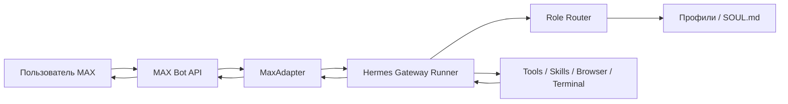
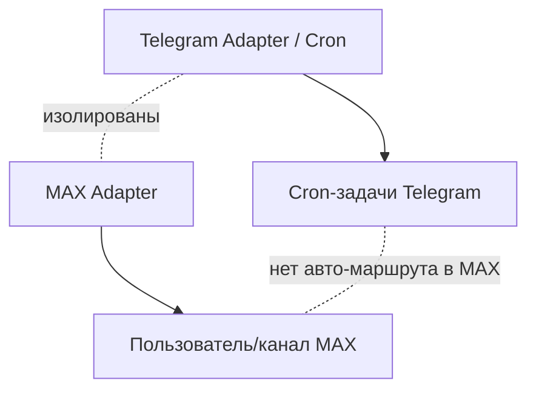

# MAX Hermes Agent

**Полноценный канал MAX для Hermes Gateway**

MAX Hermes Agent подключает мессенджер MAX к Hermes Agent как полноценный канал Gateway. Это не отдельный бот-обёртка, а platform plugin для Hermes Gateway.

Схема работы:

`MAX → MAX plugin → Hermes Gateway → Hermes Agent → tools/roles/profiles → ответ в MAX`

## Что это

Plugin, который ставится в `~/.hermes/plugins/max` и подключает мессенджер [MAX](https://max.ru) к [Hermes Gateway](https://hermes-agent.nousresearch.com). Все возможности агента — рассуждения, инструменты, роли, профили — становятся доступны прямо из чата MAX. Ядро Hermes при этом не изменяется.

## Что умеет

| Возможность | Описание |
|-------------|----------|
| **Slash-команды Hermes** | `/status`, `/model`, `/new`, `/reset` и другие — прямо из MAX |
| **Ролевые маршруты** | `/copy`, `/prompt`, `/marketing`, `/dev` и собственные роли |
| **Список разрешённых пользователей** | Отвечает только пользователям из `MAX_ALLOWED_USERS` |
| **Long Polling** | Получение обновлений через MAX Bot API, webhook не требуется |
| **Инструменты** | terminal, browser/search, write_file — из чата MAX |
| **Прогресс выполнения** | Сообщения о ходе работы инструментов в реальном времени |
| **Добавление агентов** | Создание новых агентов из MAX с предпросмотром и откатом |
| **Изоляция** | Никаких пересечений с Telegram-каналами и cron |
| **Скрипты обслуживания** | systemd/restart, smoke, doctor, check_secrets |

## Быстрый старт

```bash
# 1. Склонировать репозиторий
git clone https://github.com/pavelvladimirovich258614-sys/max_hermes_agent_new.git
cd max_hermes_agent_new

# 2. Убедиться, что в репозитории нет секретов
bash scripts/check_secrets.sh

# 3. Установить plugin в ~/.hermes/plugins/max
bash scripts/install_plugin.sh

# 4. Настроить ~/.hermes/.env (токен и список пользователей)
nano ~/.hermes/.env

# 5. Проверить токен (сам токен не печатается)
python3 scripts/verify_max_token.py

# 6. Проверить установку
bash scripts/doctor.sh

# 7. Перезапустить gateway
systemctl --user restart hermes-gateway
# или: hermes gateway restart

# 8. Проверить из MAX
# /status
# /dev скажи коротко, ты работаешь?
```

Подробнее: [docs/QUICKSTART.md](docs/QUICKSTART.md).

## Установка

Подробные инструкции — в [docs/INSTALL.md](docs/INSTALL.md):
- **Вариант A** — установка в существующий Hermes (рекомендуется)
- **Вариант B** — ручное копирование
- **Вариант C** — Docker (экспериментально)
- **Вариант D** — режим разработки

## Настройка токена

Токен бота выдаёт @metabot в MAX (см. [docs/MAX_BOT_SETUP.md](docs/MAX_BOT_SETUP.md)). Храните его только в `~/.hermes/.env`:

```env
MAX_BOT_TOKEN=PASTE_YOUR_MAX_BOT_TOKEN
MAX_ALLOWED_USERS=PASTE_YOUR_MAX_USER_ID
```

В репозитории лежит только шаблон [.env.example](.env.example) с placeholders — реальные значения никогда не коммитятся.

## Проверка

```bash
# Токен валиден (сам токен не печатается)
python3 scripts/verify_max_token.py

# Plugin установлен, файлы на месте
bash scripts/doctor.sh

# В репозитории нет секретов
bash scripts/check_secrets.sh
```

После перезапуска gateway отправьте боту `/status` в MAX — должен прийти статус агента.

## Команды в MAX

Базовые команды Hermes:

`/status` `/model` `/new` `/reset` `/stop` `/retry` `/undo` `/commands`

Управление командой агентов:

| Команда | Описание |
|---------|----------|
| `/team-add` | Предпросмотр нового агента (dry-run) |
| `/team-confirm <id>` | Реальное создание агента |
| `/team-cancel <id>` | Отмена ожидающего создания |
| `/team-rollback <name>` | Удаление агента с откатом |
| `/team-list` | Список ожидающих запросов |

Полный справочник: [docs/COMMANDS.md](docs/COMMANDS.md).

## Ролевые команды

| Команда | Роль | Для чего |
|---------|------|----------|
| `/copy` | Копирайтер | Тексты, посты, сценарии, лендинги |
| `/prompt` | Промпт-инженер | Промпты, SOUL.md, AGENTS.md |
| `/marketing` | Маркетолог | Аудитория, офферы, стратегия, аналитика |
| `/dev` | Разработчик | Код, сервер, отладка, API |

Примеры:

```
/copy Напиши продающий пост про AI-бота
/prompt Сделай промпт для рекламного видео
/marketing Придумай стратегию продвижения на 7 дней
/dev Проверь версию Python на сервере
```

Подробнее: [docs/ROLE_ROUTES.md](docs/ROLE_ROUTES.md).

## Архитектура



Изоляция от Telegram:



Подробнее: [docs/ARCHITECTURE.md](docs/ARCHITECTURE.md), [docs/CRON_AND_TELEGRAM_ISOLATION.md](docs/CRON_AND_TELEGRAM_ISOLATION.md).

## Безопасность

- **Токен хранится только в `~/.hermes/.env`** — никогда не коммитьте `.env` и не публикуйте `MAX_BOT_TOKEN`.
- **`MAX_ALLOWED_USERS` обязателен** — без списка разрешённых пользователей бот не должен работать в продакшене.
- **`MAX_ALLOW_ALL_USERS` не использовать в проде** — только для локальной отладки.
- **Скан секретов** — `bash scripts/check_secrets.sh` перед каждым коммитом/пушем.
- **Откат** — каждое создание агента через `/team-add` можно отменить.

Подробнее: [SECURITY.md](SECURITY.md) и [docs/SECURITY_CHECKLIST.md](docs/SECURITY_CHECKLIST.md).

## Откат / удаление

```bash
bash scripts/uninstall_plugin.sh
```

Скрипт удаляет только `~/.hermes/plugins/max` (спросит подтверждение). Ваши `.env`, `profiles/` и `state/` сохраняются. После удаления перезапустите gateway:

```bash
systemctl --user restart hermes-gateway
```

## Что не входит в scope

- **Webhook пока не включаем** — работает только long polling.
- **Core Hermes не патчим** — plugin ставится в `~/.hermes/plugins/max`, ядро Hermes (`/usr/local/lib/hermes-agent`) не изменяется.
- **Production-секреты не хранятся в репозитории** — только placeholders и шаблоны.

## Запуск тестов

```bash
cd plugin/max
python3 -m unittest tests.test_adapter -v
```

Тесты используют mock HTTP-ответы — реальный токен MAX не нужен.

## Документация

| Документ | Описание |
|----------|----------|
| [INSTALL.md](docs/INSTALL.md) | Установка (все варианты) |
| [QUICKSTART.md](docs/QUICKSTART.md) | Запуск за 5 минут |
| [MAX_BOT_SETUP.md](docs/MAX_BOT_SETUP.md) | Как получить токен бота MAX |
| [ARCHITECTURE.md](docs/ARCHITECTURE.md) | Как это устроено внутри |
| [COMMANDS.md](docs/COMMANDS.md) | Справочник всех команд |
| [ROLE_ROUTES.md](docs/ROLE_ROUTES.md) | Система ролевых маршрутов |
| [TEAM_ADD.md](docs/TEAM_ADD.md) | Создание агентов из MAX |
| [TOOLS_AND_PROGRESS.md](docs/TOOLS_AND_PROGRESS.md) | Инструменты через MAX |
| [CRON_AND_TELEGRAM_ISOLATION.md](docs/CRON_AND_TELEGRAM_ISOLATION.md) | Гарантии изоляции |
| [TROUBLESHOOTING.md](docs/TROUBLESHOOTING.md) | Типовые проблемы |
| [SECURITY_CHECKLIST.md](docs/SECURITY_CHECKLIST.md) | Чек-лист безопасности |
| [DOCKER.md](docs/DOCKER.md) | Использование Docker |
| [SYSTEMD.md](docs/SYSTEMD.md) | Сервис systemd |

## Отказ от ответственности

Это интеграция, поддерживаемая сообществом. См. [DISCLAIMER.md](DISCLAIMER.md).

## Лицензия

MIT — см. [LICENSE](LICENSE).
