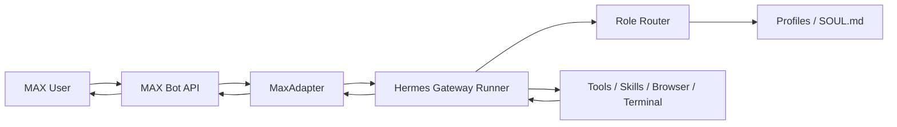
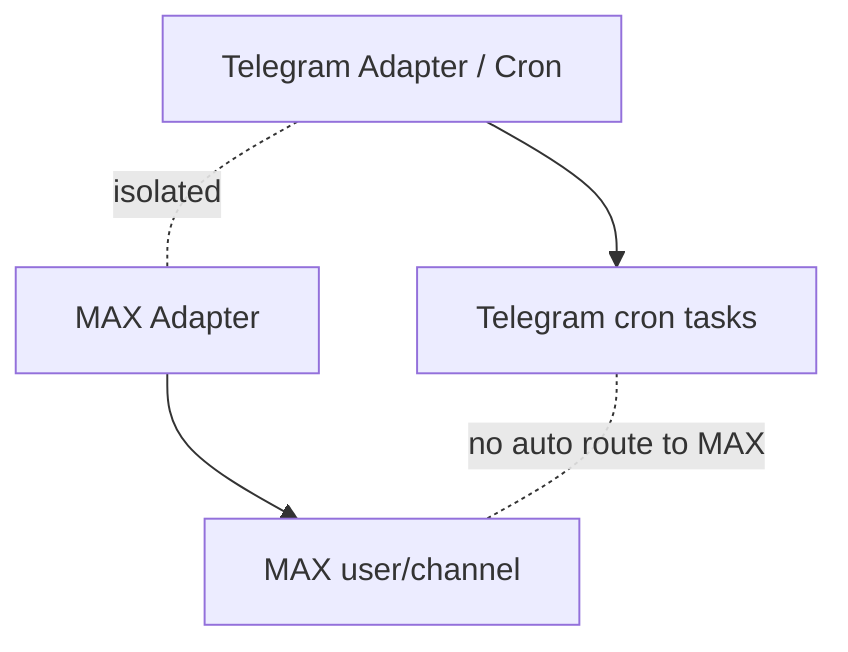

# MAX Hermes Agent

**Full Hermes Gateway Channel for MAX Messenger**

MAX connects to [Hermes Agent](https://hermes-agent.nousresearch.com) as a complete Gateway channel — not a simple bot wrapper.

## What You Get

| Feature | Description |
|---------|-------------|
| **Long Polling** | MAX updates via Bot API long polling |
| **Hermes Gateway** | Full agent loop: reasoning, tools, skills |
| **Role Routes** | `/copy`, `/prompt`, `/marketing`, `/dev`, and custom |
| **Tools** | terminal, browser/search, write_file — from MAX |
| **Progress** | Real-time tool progress messages in chat |
| **Team Add** | Create new agents from MAX with preview + rollback |
| **Allowlist** | Only authorized MAX users can interact |
| **Isolation** | No crossover with Telegram channels or cron |

## Quick Start

```bash
# 1. Clone
git clone https://github.com/pavelvladimirovich258614-sys/max_hermes_agent_new.git
cd max_hermes_agent_new

# 2. Install plugin
bash scripts/install_plugin.sh

# 3. Add your MAX bot token
cp .env.example ~/.hermes/.env.max.example
# Edit ~/.hermes/.env and add your token
nano ~/.hermes/.env

# 4. Verify token
python3 scripts/verify_max_token.py

# 5. Restart gateway
systemctl --user restart hermes-gateway
# or: hermes gateway restart

# 6. Test from MAX
# /status
# /dev скажи коротко, ты работаешь?
```

## Architecture



### Telegram Isolation



## Commands

### Hermes Core
`/status` `/model` `/new` `/reset` `/stop` `/retry` `/undo` `/commands`

### Role Routes
| Command | Role | Description |
|---------|------|-------------|
| `/copy` | Copywriter | Texts, posts, scripts, landing pages |
| `/prompt` | Prompt Engineer | Prompts, SOUL.md, AGENTS.md |
| `/marketing` | Marketer | Audience, offers, strategy, analytics |
| `/dev` | Coder | Code, server, debugging, API |

### Team Management
| Command | Description |
|---------|-------------|
| `/team-add` | Preview new agent (dry-run) |
| `/team-confirm <id>` | Create agent for real |
| `/team-cancel <id>` | Cancel pending creation |
| `/team-rollback <name>` | Remove agent + rollback |
| `/team-list` | List pending requests |

### Examples
```
/copy Напиши продающий пост про AI-бота
/prompt Сделай промпт для рекламного видео
/marketing Придумай стратегию продвижения на 7 дней
/dev Проверь версию Python на сервере
```

## Installation

See [docs/INSTALL.md](docs/INSTALL.md) for detailed instructions:
- **Option A**: Existing Hermes install (recommended)
- **Option B**: Manual copy
- **Option C**: Docker (experimental)
- **Option D**: Development mode

## Security

- **Never commit tokens** — use `.env.example` as template
- **Allowlist required** — only specified MAX users can interact
- **Secrets scan** — run `scripts/check_secrets.sh` before every push
- **Rollback** — every team-add can be undone

See [SECURITY.md](SECURITY.md) and [docs/SECURITY_CHECKLIST.md](docs/SECURITY_CHECKLIST.md).

## Running Tests

```bash
cd plugin/max
python3 -m unittest tests.test_adapter -v
```

Tests use mock HTTP responses — no real MAX token needed.

## Documentation

| Document | Description |
|----------|-------------|
| [INSTALL.md](docs/INSTALL.md) | Installation guide (all options) |
| [QUICKSTART.md](docs/QUICKSTART.md) | 5-minute setup |
| [MAX_BOT_SETUP.md](docs/MAX_BOT_SETUP.md) | Get your MAX bot token |
| [ARCHITECTURE.md](docs/ARCHITECTURE.md) | How it works internally |
| [COMMANDS.md](docs/COMMANDS.md) | All commands reference |
| [ROLE_ROUTES.md](docs/ROLE_ROUTES.md) | Role routing system |
| [TEAM_ADD.md](docs/TEAM_ADD.md) | Create agents from MAX |
| [TOOLS_AND_PROGRESS.md](docs/TOOLS_AND_PROGRESS.md) | Tools via MAX |
| [CRON_AND_TELEGRAM_ISOLATION.md](docs/CRON_AND_TELEGRAM_ISOLATION.md) | Isolation guarantees |
| [TROUBLESHOOTING.md](docs/TROUBLESHOOTING.md) | Common issues |
| [SECURITY_CHECKLIST.md](docs/SECURITY_CHECKLIST.md) | Security checklist |
| [DOCKER.md](docs/DOCKER.md) | Docker usage |
| [SYSTEMD.md](docs/SYSTEMD.md) | Systemd service |

## Disclaimer

This is a community-maintained integration. See [DISCLAIMER.md](DISCLAIMER.md).

## License

MIT — see [LICENSE](LICENSE).
