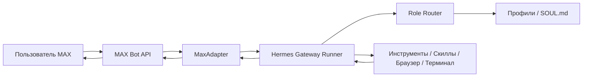
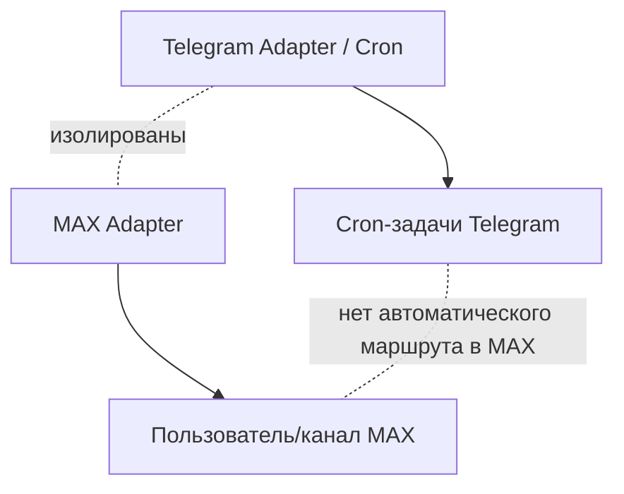

# Архитектура

## Обзор

MAX Hermes Agent — это **платформенный adapter** для Hermes Gateway. Он построен по той же схеме, что и встроенные адаптеры Telegram, Discord и Slack.

## Диаграмма компонентов



## Поток данных

### Входящий (MAX → Hermes)

1. **Long polling**: MaxAdapter вызывает MAX Bot API `GET /messages` с long polling
2. **Разбор**: `_handle_update()` извлекает текст сообщения, данные отправителя и метаданные чата
3. **Авторизация**: отправитель проверяется по allowlist (белому списку) `MAX_ALLOWED_USERS`
4. **Перехват**: проверка на slash-команды (`/status`, `/team-add`, ролевые маршруты)
5. **Диспетчеризация**: передача в Hermes Gateway Runner в виде `MessageEvent`
6. **Агент**: Hermes обрабатывает сообщение через полный конвейер (рассуждение, инструменты, скиллы)

### Исходящий (Hermes → MAX)

1. **Gateway**: агент формирует текст ответа
2. **Нарезка**: длинные ответы разбиваются на совместимые с MAX фрагменты (~500 символов)
3. **Отправка**: MaxAdapter вызывает MAX Bot API `POST /messages` для каждого фрагмента
4. **Прогресс**: прогресс инструментов показывается через edit_message (режим дозаписи)

## Ключевые компоненты

### MaxAdapter (`adapter.py`)

Основной класс адаптера, наследуется от `BasePlatformAdapter`:
- **connect()**: запуск цикла long polling
- **_handle_update()**: маршрутизация входящих сообщений
- **send()**: отправка исходящих сообщений (с нарезкой на фрагменты)
- **send_typing()**: индикатор набора текста
- **edit_message()**: дозапись сообщений о прогрессе

### Role Router

Перехватывает команды ролевых маршрутов (например, `/copy`, `/dev`) до общей диспетчеризации:
1. Загружает `role_registry.yaml` (лениво, с кэшированием)
2. Сопоставляет команду с профилем
3. Подставляет в `MessageEvent.channel_prompt` содержимое SOUL.md
4. Задаёт `MessageEvent.toolsets` из реестра
5. Передаёт событие в Gateway Runner

### Team Manager (`team_manager/core.py`)

Отвечает за процесс создания агентов:
- `validate_team_add()`: 13 проверок безопасности
- `create_pending()`: предпросмотр без применения (dry-run) с TTL
- `confirm_pending()`: фактическое создание (SOUL.md + config.yaml + реестр)
- `rollback_agent()`: полная очистка (профиль + реестр + бэкап)

### Изоляция от Telegram



- Отдельные адаптеры, отдельные конфигурации, отдельные каналы
- У MAX нет cron-задач Telegram
- У Telegram нет целей доставки в MAX
- Доставка между каналами требует явной настройки

## Структура файлов

```
~/.hermes/
├── .env                          # Секреты (MAX_BOT_TOKEN и др.)
├── plugins/max/
│   ├── adapter.py                # Основной adapter
│   ├── plugin.yaml               # Конфигурация plugin
│   ├── role_registry.yaml        # Определения ролевых маршрутов
│   └── team_manager/
│       └── core.py               # Создание/подтверждение/откат агентов
├── profiles/
│   ├── copywriter/SOUL.md        # Промпт роли копирайтера
│   ├── prompt/SOUL.md            # Промпт роли промпт-инженера
│   ├── marketer/SOUL.md          # Промпт роли маркетолога
│   └── coder/SOUL.md             # Промпт роли разработчика
└── state/
    ├── team_add_pending/         # Ожидающие создания агенты
    └── team_add_backups/         # Бэкапы реестра
```
