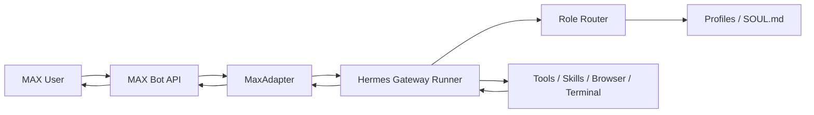
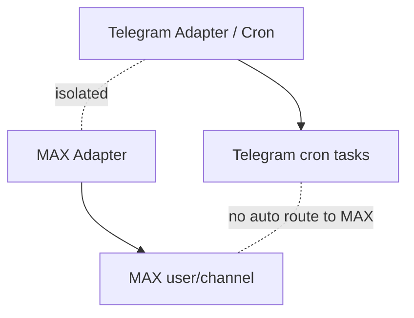

# Architecture

## Overview

MAX Hermes Agent is a **platform adapter** for the Hermes Gateway. It follows the same pattern as the built-in Telegram, Discord, and Slack adapters.

## Component Diagram



## Data Flow

### Inbound (MAX → Hermes)

1. **Long Poll**: MaxAdapter calls MAX Bot API `GET /messages` with long polling
2. **Parse**: `_handle_update()` extracts message text, sender info, chat metadata
3. **Auth**: Check sender against `MAX_ALLOWED_USERS` allowlist
4. **Intercept**: Check for slash commands (`/status`, `/team-add`, role routes)
5. **Dispatch**: Forward to Hermes Gateway Runner as a `MessageEvent`
6. **Agent**: Hermes processes through its full pipeline (reasoning, tools, skills)

### Outbound (Hermes → MAX)

1. **Gateway**: Agent produces response text
2. **Chunk**: Long responses are split into MAX-compatible chunks (~500 chars)
3. **Send**: MaxAdapter calls MAX Bot API `POST /messages` for each chunk
4. **Progress**: Tool progress shown via edit_message (append mode)

## Key Components

### MaxAdapter (`adapter.py`)

The main adapter class, inheriting from `BasePlatformAdapter`:
- **connect()**: Start long polling loop
- **_handle_update()**: Route incoming messages
- **send()**: Send outbound messages (chunked)
- **send_typing()**: Show typing indicator
- **edit_message()**: Append progress messages

### Role Router

Intercepts role-route commands (e.g., `/copy`, `/dev`) before general dispatch:
1. Load `role_registry.yaml` (lazy, cached)
2. Match command to profile
3. Inject `MessageEvent.channel_prompt` with SOUL.md content
4. Set `MessageEvent.toolsets` from registry
5. Forward to Gateway Runner

### Team Manager (`team_manager/core.py`)

Handles agent creation workflow:
- `validate_team_add()`: 13 security validations
- `create_pending()`: Dry-run preview with TTL
- `confirm_pending()`: Real creation (SOUL.md + config.yaml + registry)
- `rollback_agent()`: Full cleanup (profile + registry + backup)

### Telegram Isolation



- Separate adapters, separate configs, separate channels
- MAX has no Telegram cron tasks
- Telegram has no MAX delivery targets
- Cross-channel delivery requires explicit configuration

## File Layout

```
~/.hermes/
├── .env                          # Secrets (MAX_BOT_TOKEN, etc.)
├── plugins/max/
│   ├── adapter.py                # Main adapter
│   ├── plugin.yaml               # Plugin config
│   ├── role_registry.yaml        # Role route definitions
│   └── team_manager/
│       └── core.py               # Team add/confirm/rollback
├── profiles/
│   ├── copywriter/SOUL.md        # Copywriter role prompt
│   ├── prompt/SOUL.md            # Prompt engineer role prompt
│   ├── marketer/SOUL.md          # Marketer role prompt
│   └── coder/SOUL.md             # Coder role prompt
└── state/
    ├── team_add_pending/         # Pending agent creations
    └── team_add_backups/         # Registry backups
```
